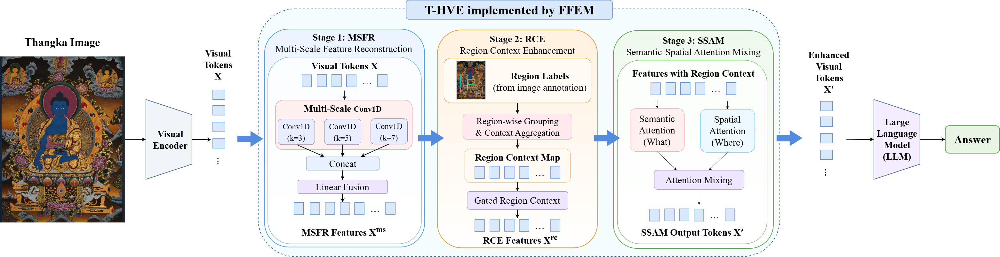

# ThangkaVLM - Thangka Vision-Language Model

[](https://doi.org/10.5281/zenodo.20252014)

Official implementation accompanying the manuscript:

**"Hierarchical Visual Enhancement for Reliable Thangka Visual Question Answering"**

Submitted to **The Visual Computer**.

ThangkaVLM focuses on reliable visual question answering for highly structured Thangka images. The proposed **Thangka Hierarchical Visual Enhancement (T-HVE)** mechanism is implemented through a **Fine-Grained Feature Enhancement Module (FFEM)** to strengthen fine-grained visual representations and improve answer reliability.

---

## 🌟 Features

- **Thangka Visual Question Answering:** Visual question answering for highly structured Thangka images with dense iconographic details.
- **T-HVE:** Thangka Hierarchical Visual Enhancement for progressively strengthening visual representations.
- **FFEM:** Fine-Grained Feature Enhancement Module consisting of **MSFR**, **RCE**, and **SSAM**.
- **Structured Region Information:** Region annotations are mapped to visual tokens to support regional context modeling.
- **LoRA Training:** Parameter-efficient adaptation based on **Qwen3-VL-8B-Instruct**.

---

## 🧩 Method Overview

The proposed **Thangka Hierarchical Visual Enhancement (T-HVE)** mechanism progressively enhances visual representations at three levels: local detail enhancement, regional context modeling, and global semantic-spatial enhancement.

T-HVE is implemented through the proposed **Fine-Grained Feature Enhancement Module (FFEM)**.

<p align="center">
  
</p>

<p align="center">
  <b>Figure 2.</b> Overview of the proposed T-HVE framework and the implementation of FFEM.
</p>

FFEM consists of three components:

- **MSFR — Multi-Scale Feature Reconstruction:** enhances local fine-grained visual features through multi-scale feature transformations.
- **RCE — Region Context Enhancement:** aggregates visual information within annotated structural regions to construct region-level contextual representations.
- **SSAM — Semantic-Spatial Attention Mixing:** models semantic dependencies and spatial relationships among visual tokens.

---

## 📊 Main Results

We evaluate the proposed method on the **Thangka-VQA** test set using **Qwen3-VL-8B-Instruct** as the main vision-language backbone.

| Method | Standard Acc. | Adversarial Acc. | Overall Acc. | Strict HR |
|---|---:|---:|---:|---:|
| Qwen3-VL-8B + LoRA | 98.55% | 86.93% | 92.28% | 4.96% |
| Qwen3-VL-8B + LoRA + FFEM | **99.79%** | **91.70%** | **95.42%** | **4.10%** |

FFEM improves the overall accuracy from **92.28% to 95.42%** while reducing the strict hallucination rate from **4.96% to 4.10%**.

---

## 📚 Thangka-VQA Dataset

Thangka-VQA is a visual question answering dataset constructed for highly structured Thangka images.

The dataset contains **1,028 images** and **10,024 question-answer pairs**.

| Split | Images | QA Pairs |
|---|---:|---:|
| Train | 820 | 8,003 |
| Validation | 100 | 972 |
| Test | 108 | 1,049 |
| **Total** | **1,028** | **10,024** |

The dataset contains both standard and adversarial questions and includes structured region annotations for fine-grained visual modeling.

---

## 📁 Project Structure

```text
ThangkaVLM/
├── assets/
│   └── Figure2.png
├── examples/
├── config.json
├── ffem.py
├── model_registration.py
├── modeling_qwen3_vl_ffem.py
├── requirements.txt
├── thangka_dataset.py
├── train_thangka_custom.py
└── README.md
```

### Main Files

- `ffem.py` — implementation of the Fine-Grained Feature Enhancement Module.
- `modeling_qwen3_vl_ffem.py` — Qwen3-VL model implementation with FFEM integration.
- `model_registration.py` — custom model registration.
- `thangka_dataset.py` — dataset loading and preprocessing.
- `train_thangka_custom.py` — training script.
- `config.json` — model configuration.
- `examples/` — example resources.

---

## 📦 Installation

### 1. Clone the Repository

```bash
git clone https://github.com/Zhangjing-alt/ThangkaVLM.git
cd ThangkaVLM
```

### 2. Install Dependencies

```bash
pip install -r requirements.txt
```

The main experiments are based on **Qwen3-VL-8B-Instruct**. Please prepare the pretrained model weights separately before training.

---

## 📊 Data Format

The dataset uses structured annotations containing image information, element-level annotations, bounding boxes, and question-answer pairs.

Example:

```json
{
  "instances": [
    {
      "image_id": "003.jpg",
      "is_mirrored": true,
      "elements": [
        {
          "label": "YellowJambhala",
          "name_zh": "Yellow Jambhala",
          "role": "main_deity",
          "bbox": [232, 223, 1398, 1631]
        }
      ],
      "qa_pairs": [
        {
          "question": "Who is the figure at the center of the image?",
          "answer": "Yellow Jambhala",
          "question_type": "identification"
        }
      ]
    }
  ]
}
```

The structured bounding-box annotations can be mapped to the visual-token grid to construct region-level information used by RCE.

---

## 🚀 Training

Training is performed with **Qwen3-VL-8B-Instruct** and LoRA adaptation.

The main experimental configuration uses:

```text
LoRA rank                = 16
LoRA alpha               = 32
LoRA dropout             = 0.05

Epochs                    = 10
Micro batch size          = 2
Gradient accumulation     = 8
Effective batch size      = 16

LoRA learning rate        = 2e-4
FFEM learning rate        = 4e-4

Maximum image side        = 448
Precision                 = BF16
```

The LoRA target modules are:

```text
q_proj
k_proj
v_proj
o_proj
gate_proj
up_proj
down_proj
```

Use `train_thangka_custom.py` as the main training entry:

```bash
python train_thangka_custom.py \
    --model_path /path/to/Qwen3-VL-8B-Instruct \
    --data_dir /path/to/thangka_data \
    --output_dir /path/to/output
```

Please adapt the paths and training arguments according to your local environment and the options provided by the training script.

---

## 🔬 Core Functions

### Multi-Scale Feature Reconstruction (MSFR)

MSFR performs multi-scale transformations of visual-token features to strengthen the representation of local textures and fine-grained visual details.

### Region Context Enhancement (RCE)

RCE uses structured region information to construct region-level contextual representations. Visual tokens belonging to the same annotated region are aggregated so that regional structural information can be incorporated into visual feature enhancement.

### Semantic-Spatial Attention Mixing (SSAM)

SSAM models global semantic dependencies and spatial relationships among visual tokens and integrates them with the preceding fine-grained and regional representations.

---

## 📏 Evaluation

The main evaluation reports:

- **Standard Accuracy**
- **Adversarial Accuracy**
- **Overall Accuracy**
- **Strict Hallucination Rate (Strict HR)**

For binary existence questions, a prediction that asserts the presence of a visual element when the ground truth indicates its absence is counted as an existence hallucination.

A recognition false negative affects answer accuracy but is not counted as an existence hallucination.

The same evaluation protocol is applied to the LoRA baseline and the LoRA + FFEM model.

---

## ⚠️ Notes

- Pretrained Qwen3-VL model weights are not included in this repository.
- Dataset images and annotations should be used in accordance with their corresponding copyright and redistribution conditions.
- Paths in the example commands should be adapted to your local environment.
- The region annotations used by RCE are structured dataset annotations rather than model-generated grounding predictions.
- The repository documentation will be updated together with subsequent manuscript revisions.

---

## 📖 Citation

If you find this work useful, please consider citing our manuscript:

```bibtex
@article{thangkavlm2026,
  title={Hierarchical Visual Enhancement for Reliable Thangka Visual Question Answering},
  author={Anonymous},
  note={Manuscript submitted to The Visual Computer},
  year={2026}
}
```

Citation information will be updated after publication.
